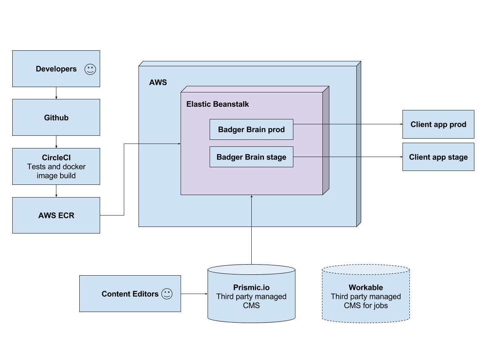
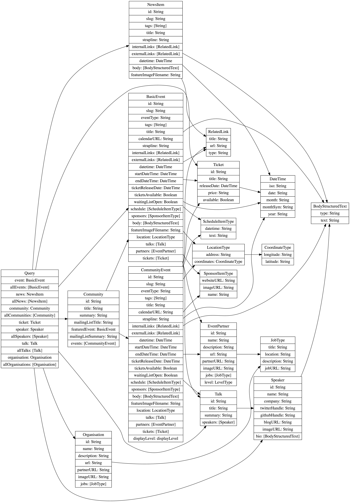

# Dev docs

This is official dev documentation of the Badger Brain project.

Live GraphiQL interface: [http://brain.red-badger.com/graphql](http://brain.red-badger.com/graphql)

Staging GraphiQL interface: [http://brain-staging.red-badger.com/graphql](http://brain-staging.red-badger.com/graphql)

## How to update this documentation

Documentation is written in markdown format and is hosted under `/docs` folder. Once the change is committed, it will be automatically deployed by Github on this site.

## Introduction and purpose

Badger Brain is a GraphQL server. It has GraphiQL interface for testing and exploring the API. It is a self documented server - you can simply browse what GraphiQL has to offer, and every query or a parameter will have a description.

Badger Brain is a public GraphQL interface providing data about Red Badger company. At the moment of writing you can request following data:

* Social events
* Company news
* Event partners
* Communities
* Event talks
* Event speakers
* Badgers

The purpose of the Badger Brain is to serve all public (and potentially private) information about the company to whoever might be interested to consume it. If we ever decide to include private information in the schema, that will require some sort of authentication mechanism.

## Infrastructure

Workable integration is not implemented at the moment, but would be a logical step in making Badger Brain central provider for all company related data.

## Clients

At the moment of writing, there are following client apps depending on Badger Brain:

* [Website Next](https://github.com/redbadger/website-next)
* [React.London](https://github.com/redbadger/react.london/)

New features of Badger Brain are largely dictated by the needs of clients. It should not however implement purely client based features, but instead aim at providing unified consistent interface through all features.

## Prismic schema

Prismic.io at the moment our main data provider. Because Prismic itself doesn't contain any tools for schema versioning and migrations, we're hosting Prismic schema definitions here, under `/prismic`.

Your responsibility as a developer is to maintain Prismic schema definitions here for versioning purposes.

## Visualising schema

You can generate a diagram of Badger Brain GraphQL schema by following these easy steps:

* `brew install graphviz`
* `npm install -g graphqlviz`
* Run Badger Brain with `npm start`
* Open another console tab and run `graphqlviz http://localhost:3001/graphql -a | dot -Tpng -o graph.png`
* Congratulations, you have generated most up to date version of the schema diagram

## Data flow

Badger Brain offers read-only API, which means there is no way of posting data back to Badger Brain. It doesn't contain any mutations.
